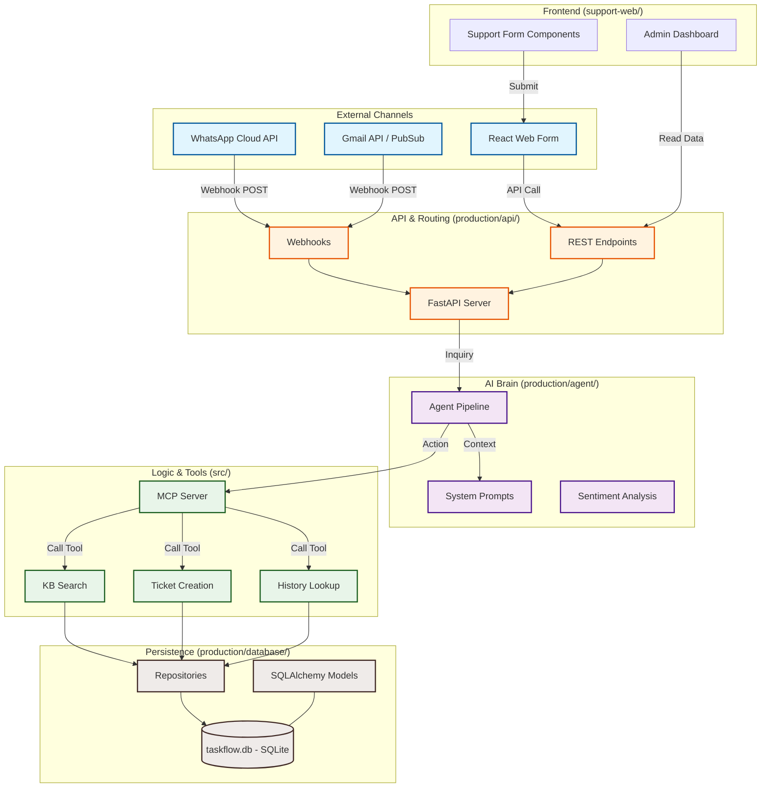

# 🗺️ TaskFlow AI: Digital FTE System Map
### Comprehensive Architectural & Folder Flow

This document provides a high-fidelity visual map of the TaskFlow AI Support Agent. It illustrates how incoming requests from WhatsApp, Gmail, and Web Forms are processed by the AI Brain, managed via MCP tools, and persisted in the Real-Base SQLite database.

## 🏗️ System Architecture

## 📂 Folder-to-Function Mapping

| Folder Path | Function | Description |
|:---|:---|:---|
| `production/api/` | **Entry Point** | FastAPI app, webhooks, and routing logic. |
| `production/agent/` | **AI Reasoning** | Agent pipeline, multi-model prompts, and sentiment analysis. |
| `production/channels/` | **I/O Handlers** | Specific logic for Gmail and WhatsApp APIs. |
| `src/` | **Tool Layer** | Model Context Protocol (MCP) server and implementation. |
| `production/database/` | **Real-Base** | SQLite schema, repository patterns, and persistent storage. |
| `support-web/` | **UI/UX** | Next.js/Tailwind dashboard for monitoring support tickets. |
| `production/workers/` | **Async Processing** | Kafka-ready workers for message queues. |

## 🔄 Interaction Sequence

1. **TRIGGER:** A customer sends a WhatsApp message or Email.
2. **INGEST:** The `channels/` handler parses the payload and sends it to the `api/`.
3. **THINK:** The `agent/` pipeline analyzes sentiment and decides which MCP tool to call.
4. **ACT:** The `src/mcp_server.py` executes a tool (e.g., search knowledge base).
5. **STORE:** Data is saved to the `taskflow.db` using `production/database/` repos.
6. **RESPOND:** The AI generates a brand-compliant reply and sends it back through the channel.

---
*Generated for TaskFlow AI Final Hackathon Submission — 2026*
